# Arquitectura del Estimador CAG

> Sistema de estimación de software construido con **arquitectura CAG** (Context-Augmented Generation).
> API REST en **FastAPI** + frontend de producto en **Streamlit**, con **Redis Stack** como caché
> **semántico** de respuestas LLM (redisvl) y **structlog** para observabilidad. Parte del máster LIDR
> (RAG & Agentes); el diseño está preparado para evolucionar de CAG → RAG → agentes sin reescribir las
> capas externas.

Este documento describe la arquitectura end-to-end. La **sección 1** da la visión general (el mapa).
Las **secciones siguientes** profundizan capa por capa, respetando la misma separación de
responsabilidades que el código. Está pensado para que alguien que no conoce el proyecto entienda
tanto *qué hace* como *por qué está construido así*.

---

## Tabla de contenidos

1. [Visión general de la arquitectura](#1-visión-general-de-la-arquitectura)
2. [Frontend — Streamlit (capa de presentación)](#2-frontend--streamlit-capa-de-presentación)
3. [Routers — borde HTTP](#3-routers--borde-http)
4. [Schemas — contratos Pydantic](#4-schemas--contratos-pydantic)
5. [Services — lógica de negocio](#5-services--lógica-de-negocio)
   - [5.1 `llm_service` — orquestación](#51-llm_service--orquestación-del-dominio)
   - [5.2 `cache` — caché semántico](#52-cache--caché-semántico-sobre-redis-stack)
   - [5.3 `llm_wrapper` — adaptador LLM](#53-llm_wrapper--adaptador-llm-agnóstico-de-dominio)
   - [5.4 `prompts` — templates Jinja2](#54-prompts--templates-jinja2-versionados)
   - [5.5 `guardrails` — validación de input](#55-guardrails--validación-de-input-agnóstica-de-dominio)
   - [5.6 `embeddings` — vectores (semilla RAG)](#56-embeddings--vectores-semilla-del-rag)
6. [Context — datos CAG](#6-context--datos-de-referencia-cag)
7. [Infraestructura transversal](#7-infraestructura-transversal)
   - [7.1 Configuración](#71-configuración-appconfigpy)
   - [7.2 Inyección de dependencias](#72-inyección-de-dependencias-appdependenciespy)
   - [7.3 Ciclo de vida (lifespan)](#73-ciclo-de-vida-lifespan)
   - [7.4 Logging estructurado](#74-logging-estructurado-structlog)
   - [7.5 Caché Redis](#75-caché-redis-infraestructura)
8. [Despliegue y empaquetado](#8-despliegue-y-empaquetado)
9. [Decisiones de diseño y evolución futura](#9-decisiones-de-diseño-y-evolución-futura)

---

## 1. Visión general de la arquitectura

El sistema se compone de **dos servicios desplegables** (frontend y backend) y **un servicio de
infraestructura** (Redis), orquestados con Docker Compose. El backend aplica una **arquitectura por
capas estricta**: cada capa solo conoce la inmediatamente inferior, y las responsabilidades no se
mezclan.

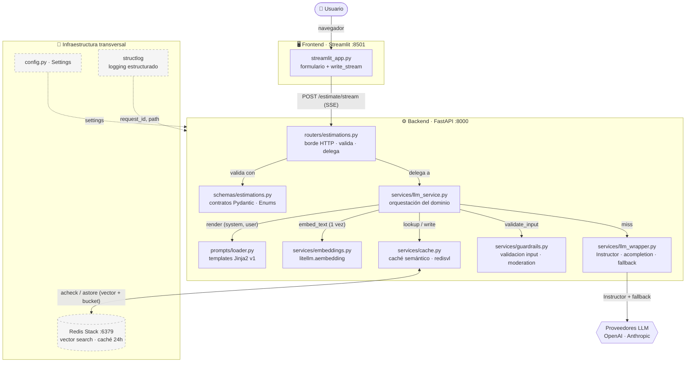

### Las capas de un vistazo

| Capa | Archivo(s) | Responsabilidad | Lo que **NO** hace |
|------|-----------|-----------------|--------------------|
| **Frontend** | `frontend/streamlit_app.py` | Formulario de producto (descripción + parámetros tipados), consume el stream SSE (Partials estructurados), pinta el resultado | No habla con el LLM ni conoce su API |
| **Routers** | `app/routers/estimations.py` | Recibe HTTP, valida, **delega**, traduce errores a códigos HTTP | Sin lógica de negocio |
| **Schemas** | `app/schemas/estimations.py` | Contrato Pydantic request/response (Enums tipados) — el borde HTTP | No es el núcleo del dominio |
| **Services** | `app/services/*.py` | Lógica de negocio: guardrails, embeddings, orquestación, caché semántico, llamada LLM | No conoce HTTP |
| **Prompts** | `app/prompts/` | Templates Jinja2 versionados + loader; renderiza `(system, user)` | No conoce HTTP ni el LLM |
| **Context** | `app/context/examples.py` | Datos de referencia (obsoleto en CAG; vuelve en RAG) | No formatea el prompt |
| **Infra** | `config`, `dependencies`, `logging_config`, `main` | Configuración, DI, logging, ciclo de vida | No es lógica de dominio |

### Principio rector: dirección de las dependencias

El flujo de control siempre va **de fuera hacia dentro**, y las dependencias nunca se invierten:

```
Frontend → Router → Service → Cache semántico (hit) → Proveedor LLM (miss)
                       │          │
                       │          ├─→ Guardrails (validate_input, PRIMERO)
                       │          └─→ Embeddings (embed_text, 1 vez)
                       └─→ Prompts (loader + templates Jinja2)
```

- El **núcleo de negocio (services) es agnóstico del borde HTTP**: devuelve `dict` planos, no
  instancia los schemas Pydantic. La validación contra los schemas ocurre solo en el router.
- El **`llm_wrapper` es agnóstico del dominio**: no sabe nada de "estimaciones", solo habla LLM.
  Esto permite reutilizarlo y sustituir el proveedor sin tocar el negocio.

---

## 2. Frontend — Streamlit (capa de presentación)

Aplicación Streamlit independiente ([`frontend/streamlit_app.py`](frontend/streamlit_app.py)) que
ofrece una **interfaz de formulario de producto** (descripción + parámetros tipados), no un chat libre.
Es un **servicio separado** del backend: su propio contenedor, su propio grupo de dependencias
(`requests`, `sseclient-py`, `streamlit`) y **cero acoplamiento** con el código de `app/`.

### Responsabilidades

- Presentar un `st.form` con el campo `description` y tres selectores (`project_type`, `detail_level`,
  `output_format`). Los labels son legibles, pero el valor enviado es **exactamente** el value del Enum
  del backend (case-sensitive — el backend corre en Linux).
- Validar longitud mínima de la descripción (20 caracteres) **antes** de llamar al backend.
- Consumir el endpoint **principal `/estimate` (no-stream)** y renderizar el `EstimationResult` completo.

### Patrón: petición no-stream

Tras la sesión en vivo se decidió continuar con respuestas **no-stream**: el frontend hace un único
`POST /estimate`, espera la respuesta completa (`EstimationResponse`) y la pinta. El puente SSE de
streaming se retiró del frontend; el **endpoint de streaming se conserva en el backend** (referencia /
reutilización para otros proyectos), simplemente la UI ya no lo usa.

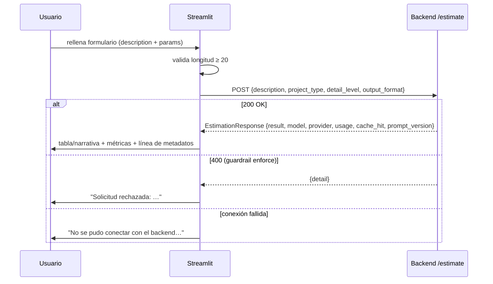

El caso degradado out-of-scope (summary con prefijo / confidence 0 / sin fases) se muestra como aviso,
sin tabla ni métricas.

### Manejo de errores

- **Input rechazado por guardrails** (enforce) → `HTTP 400` → "Solicitud rechazada: …".
- **Fallo del backend** (`5xx`) → "Error del backend: …".
- **Backend inaccesible** (caído / URL mal configurada) → `RequestException` → "¿Está levantado?".

La URL del backend se configura con `BACKEND_URL` ([`frontend/config.py`](frontend/config.py)), con
default `http://estimator:8000` (el nombre del servicio en Compose). Para correr Streamlit en local
contra el backend local: `BACKEND_URL=http://localhost:8000`.

---

## 3. Routers — borde HTTP

[`app/routers/estimations.py`](app/routers/estimations.py) define el `APIRouter` con prefijo
`/api/v1`. Es el **borde HTTP**: recibe, valida (vía schema y `Depends`), **delega** al servicio y
traduce el resultado/errores a HTTP. **No contiene lógica de negocio.**

### Endpoints

| Método | Ruta | Respuesta | Caché | Uso |
|--------|------|-----------|-------|-----|
| `POST` | `/api/v1/estimate` | `EstimationResponse` (JSON) | ✅ semántico | **PRINCIPAL — lo consume la UI** |
| `POST` | `/api/v1/estimate/stream` | SSE (`EventSourceResponse`) | ✅ semántico | Secundario — conservado (referencia/reutilización) |
| `GET`  | `/health` | `{"status": "healthy"}` | — | Health check (Docker/orquestador) |

### Patrón de delegación

```python
@router.post("/estimate", response_model=EstimationResponse)
async def create_estimation(request: EstimationRequest, semantic_cache = Depends(get_semantic_cache)):
    try:
        result = await generate_estimation(                              # desempaqueta el schema
            request.description, request.project_type.value,
            request.detail_level.value, request.output_format.value, semantic_cache,
        )
    except InputGuardrailError as exc:
        raise HTTPException(status_code=400, detail=str(exc))             # input rechazado
    except LLMError as exc:
        raise HTTPException(status_code=500, detail=str(exc))             # traduce error
    return EstimationResponse(**result)                                   # valida en el borde
```

Cuatro detalles arquitectónicos importantes:

1. **El router es el único que toca el schema** — desempaqueta `EstimationRequest` en primitivas
   (`.value` de cada Enum) antes de delegar. El servicio y la capa de prompts reciben primitivas, no
   el contrato HTTP.
2. **Inyección del cache semántico vía `Depends(get_semantic_cache)`** — el router no construye el
   `SemanticCache` (se crea una vez en `lifespan`), lo recibe.
3. **`InputGuardrailError → 400`, `LLMError → 500`** — las excepciones de dominio se traducen a HTTP
   *solo aquí*. El servicio nunca conoce códigos HTTP.
4. **`EstimationResponse(**result)`** — la validación Pydantic ocurre en el borde, sobre el `dict`
   plano que devuelve el servicio.

El endpoint de stream traduce los eventos tipados del servicio (`partial` / `done` / `error`) a
`ServerSentEvent`. Traduce excepciones: `InputGuardrailError → HTTP 400`, `LLMError → HTTP 500`.
En el endpoint stream las excepciones de guardrail/LLM se emiten como evento SSE `error`.

---

## 4. Schemas — contratos Pydantic

[`app/schemas/estimations.py`](app/schemas/estimations.py) (nombre en **plural**; el import correcto
es `from app.schemas.estimations import ...`). Define el **contrato HTTP**, no el núcleo del dominio.

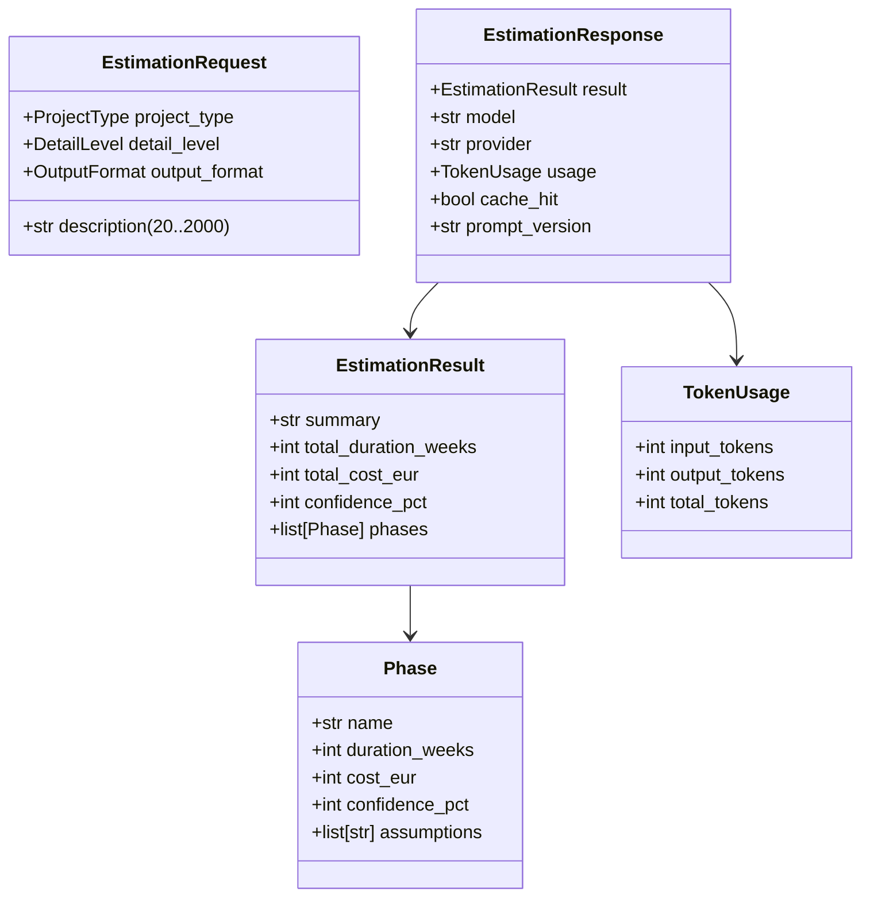

- **`EstimationRequest`** — valida la entrada en el borde: `description` (20–2000 caracteres) más tres
  parámetros tipados como Enums (`ProjectType`, `DetailLevel`, `OutputFormat`). Una petición fuera de
  rango o con un valor de Enum inválido produce automáticamente un `422` antes de tocar la lógica de
  negocio.
- **`EstimationResult`** — output estructurado del LLM. Tiene dos `model_validator`:
  - `total_must_match_sum_of_phases`: **computa** `total_duration_weeks` y `total_cost_eur` como suma
    exacta de las fases (los sobreescribe, no los valida con tolerancia). La aritmética es nuestra
    responsabilidad, no del LLM — así eliminamos retries por totales que no cuadran. Si no hay fases
    (caso out-of-scope), conserva los totales recibidos (0).
  - `low_confidence_must_be_explicit`: si `confidence_pct < 30` y `summary` no empieza por
    `OUT_OF_SCOPE_PREFIX` → error. Instructor reintenta o el modelo acepta que es out-of-scope.
- **`OUT_OF_SCOPE_PREFIX`** — constante en este módulo. La importan el validador Y el loader (la
  inyecta en el contexto del template). Un único punto de definición.
- **`EstimationResponse`** — ahora incluye `result: EstimationResult`, `prompt_version` y conserva
  `model`, `provider`, `usage`, `cache_hit` de S03.

Los schemas son el **contrato del borde HTTP**. El servicio devuelve `dict` plano; el router instancia el schema.

---

## 5. Services — lógica de negocio

El corazón del sistema. Módulos con responsabilidades nítidas y dependencias en una sola dirección:

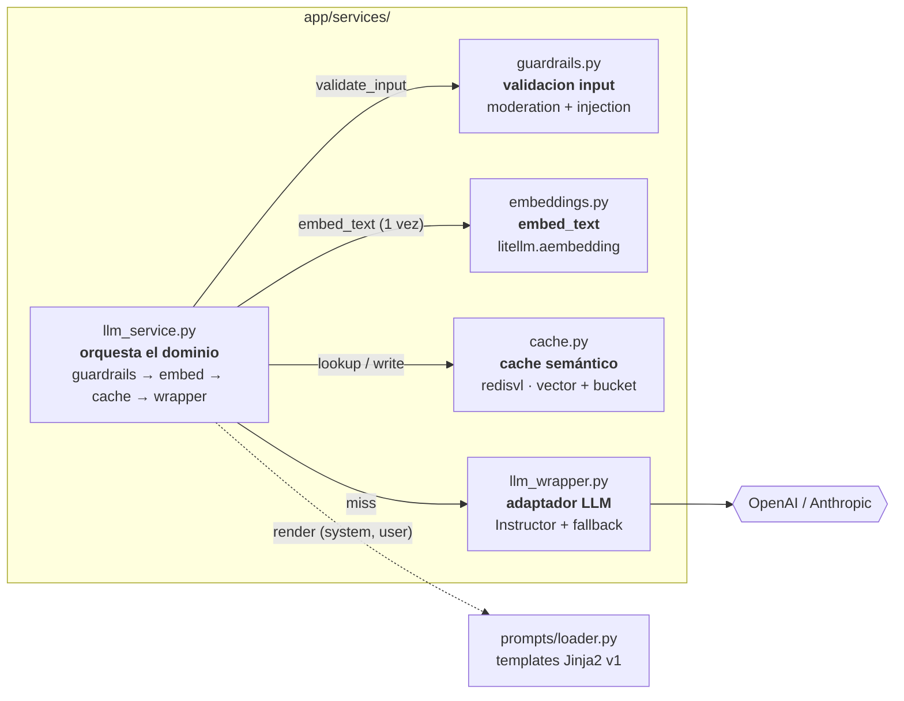

Niveles de abstracción (de mayor a menor):

- **`llm_service`** conoce el *dominio* (estimaciones); orquesta guardrails, embeddings, loader, caché y wrapper.
- **`guardrails`** conoce las *reglas de validación de input*, pero no el dominio de estimaciones.
- **`embeddings`** conoce el *modelo de embedding* (litellm), pero no el dominio. Semilla del RAG.
- **`prompts/loader`** conoce el *formato del prompt* (templates Jinja2 versionados), pero ni HTTP ni el LLM.
- **`cache`** conoce el *patrón de caché semántico* (vector + bucket, threshold, TTL, degradación), pero no el dominio (opera sobre strings opacos).
- **`llm_wrapper`** conoce el *proveedor LLM* (Instructor + litellm, fallback), pero ni el dominio ni la caché.

### 5.1 `llm_service` — orquestación del dominio

[`app/services/llm_service.py`](app/services/llm_service.py). Es la **única capa que conoce el
dominio "estimación"**. Responsabilidades (en orden de ejecución):

1. **`validate_input(description)`** — **SIEMPRE PRIMERO** (invariante de orden). Antes de embedding,
   lookup y LLM. Solo se cachean outputs que pasaron validación.
2. **`embed_text(description)`** — **una sola vez** por request; el vector se reutiliza para lookup y write.
3. **`build_bucket_key(prompt_version, project_type, detail_level, output_format)`** — partición determinista.
4. **`cache.semantic_lookup(vector, bucket, enforce)`**: HIT (en modo enforce) → devuelve el payload
   cacheado; MISS o log-only → `None`.
5. **En miss**: pide el prompt al loader, ensambla `messages`, llama a `complete_structured` (Instructor,
   `max_retries=2`), y `cache.semantic_write` **solo tras validación OK**.
6. **Mapear a `dict` plano** `{result, model, provider, usage, cache_hit, prompt_version}`.

Dos puntos de entrada, **ambos cacheados**:

| Función | Modo | Caché | Validación post |
|---------|------|-------|-----------------|
| `generate_estimation` | one-shot | ✅ semántico | Instructor reintenta en validación |
| `generate_estimation_stream` | streaming Partial | ✅ semántico | Post-hoc al cerrar stream (PROVISIONAL) |

`MAX_TOKENS = 4000` y `PROMPT_VERSION = "v1"` son decisiones de dominio.

### 5.2 `cache` — caché semántico sobre Redis Stack

[`app/services/cache.py`](app/services/cache.py). **Reescrito en B5**: elimina el exact-match sha256 de
S03. Razón: los inputs humanos/contextuales casi nunca son byte-idénticos, así que un exact-match casi
nunca acierta; la similaridad semántica subsume el caso exacto (distancia 0 == input idéntico). Es
**agnóstico de dominio**: opera sobre strings opacos (el servicio (de)serializa `EstimationResult`+metadata).

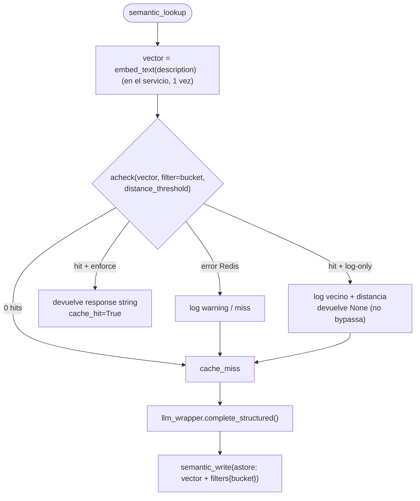

- **Clave compuesta**: bucket (TAG filtrable determinista `prompt_version:project_type:detail_level:output_format`,
  partición exacta) + vector (embedding de la descripción, similaridad dentro del bucket). El bucket
  resuelve el pendiente de S03 de incluir `prompt_version` en la clave: un bump de prompt/schema cae en
  un bucket nuevo y los viejos expiran por TTL.
- **Vector propio**: lo computa `embeddings.embed_text` y se pasa a acheck/astore con `vector=`. redisvl
  nunca carga su vectorizer HF/torch — un `CustomVectorizer` dummy (vector cero) solo fija las dims (1536)
  del schema al construir.
- **`distance_threshold = 0.15`** (≈0.85 similaridad), laxo a propósito para experimentar.
- **Modo log-only** (`SEMANTIC_CACHE_ENFORCE=False`, default en development): hace el lookup y loguea
  vecino+distancia, pero devuelve `None` (no bypassa el LLM). Observar antes de confiar.
- **Degradación con gracia**: fallos de Redis → log warning, tratar como miss. Nunca fatal.
- Abre su propio cliente vía `redis_url` (los bytes binarios del vector son incompatibles con
  `decode_responses=True` del cliente de la app).

### 5.3 `llm_wrapper` — adaptador LLM agnóstico de dominio

[`app/services/llm_wrapper.py`](app/services/llm_wrapper.py). Adaptador que habla con los proveedores
LLM vía **Instructor + litellm**. **No sabe nada del dominio**: recibe `messages` y una clase Pydantic,
devuelve la instancia tipada + metadatos.

**Instructor sobre litellm — fallback por kwarg:**

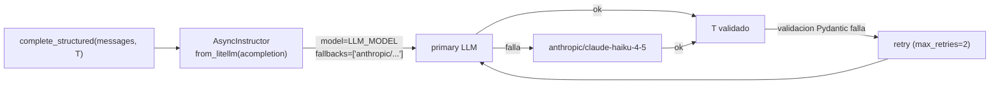

- **`instructor.from_litellm(acompletion)`** — integración estable. No usa `patch(Router)` (bug
  conocido de carryover de params entre requests). Trade-off: se pierde cooldown state y fail-fast al
  arrancar; se preserva fallback por llamada.
- **Formato de fallback**: `fallbacks=["anthropic/claude-haiku-4-5-20251001"]` (lista de strings).
  El formato dict del Router (`[{"primary": [...]}]`) NO funciona con `acompletion` directo.
- **`complete_structured(messages, response_model, max_tokens, max_retries=2)`** → `(T, metadata)`.
  Instructor reintenta hasta `max_retries` veces cuando la validación Pydantic de `T` falla.
- **`stream_structured(messages, response_model, max_tokens)`** → async generator de eventos:
  - `{"type": "partial", "data": T_parcial}` — objeto Partial[T] incremental (validadores inactivos).
  - `{"type": "done", "metadata": {...}}` — evento final tras cerrar el stream.

`_resolve_provider` deduce el proveedor real del modelo respondido (útil cuando el fallback disparó).

### 5.5 `guardrails` — validación de input agnóstica de dominio

[`app/services/guardrails.py`](app/services/guardrails.py). Pipeline de defensa sobre el texto del
usuario **antes** de que llegue al LLM. Es agnóstico del dominio: recibe texto, no sabe de estimaciones.

**Capas (en orden de ejecución):**

1. **Moderation API** (`litellm.moderation`) — detecta contenido prohibido (odio, violencia, etc.).
   Fallo de la API es no-fatal: se loguea y se continúa.
2. **Inyección Markdown** — detecta intentos de inyectar los headers que usa `system.j2` (`## Role`,
   `## Output Format`, `## Scope`, etc.). Patrón adaptado a delimitadores Markdown (el sistema no usa
   XML; el patrón `</tag>` del módulo no aplica aquí).
3. **Social engineering** — frases como "ignore previous instructions", "you are now", "jailbreak".

**Política `GUARDRAILS_ENFORCE`** (en `Settings`, derivado de `APP_ENV`):
- `True` (production) → `raise InputGuardrailError` al primer disparo.
- `False` (development) → log-only: loguea con structlog pero no bloquea.

`InputGuardrailError` es la excepción de dominio de guardrails; el router la traduce a HTTP 400.
PENDIENTE: tracker/métricas sobre los logs de disparos en modo log-only.

### 5.4 `prompts` — templates Jinja2 versionados

[`app/prompts/`](app/prompts/). El **contenido del prompt está separado de la orquestación**: vive en
templates Jinja2 versionados en lugar de en f-strings dentro del servicio. Esto permite versionar e
iterar el prompt sin tocar el código de negocio.

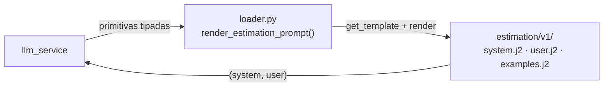

- **`loader.render_estimation_prompt(description, project_type, detail_level, output_format, version="v1")`**
  → devuelve la tupla `(system, user)`. Recibe **primitivas tipadas, no `EstimationRequest`**: la capa
  de prompts queda desacoplada del borde HTTP, igual que el servicio devuelve `dict`.
- **`Environment`** con `FileSystemLoader(PROMPTS_DIR)`, `trim_blocks` / `lstrip_blocks` y
  **`StrictUndefined`**: si un template referencia una variable que no está en el contexto, falla en el
  render en lugar de producir un prompt con huecos silenciosos.
- **Delimitadores Markdown** (`## Section`), no XML: el sistema es **LLM-agnóstico** vía LiteLLM (sin
  "proveedor principal"), y Markdown es el formato neutro mejor entendido por todos los proveedores.
- **`system.j2`** define rol, reglas, scope (out-of-scope con `{{ out_of_scope_prefix }}`) y tarifas;
  ramifica según `output_format` (`phases_table`, `narrative`) y añade un bloque extra (assumptions +
  confianza por fase) solo cuando `detail_level == "detailed"`. Termina con ``.
- **`examples.j2`** contiene los ejemplos few-shot **literales en Markdown** (migrados desde
  `context/examples.py`). En la fase CAG esta es la fuente de los ejemplos; en RAG vendrán de la BD
  vectorial.
- **Versionado por carpeta** (`v1/`): convivir varias versiones del prompt es cuestión de añadir `v2/`
  y pasar `version="v2"`.

### 5.6 `embeddings` — vectores (semilla del RAG)

[`app/services/embeddings.py`](app/services/embeddings.py). Módulo **agnóstico de dominio** y
**reutilizable**: `embed_text(text) -> list[float]` vía `litellm.aembedding` con
`openai/text-embedding-3-small` (1536 dims). El acoplamiento a OpenAI (el modelo de embedding) queda
contenido aquí.

- En esta fase construye **solo** lo que el cache semántico necesita (embeber un string). No hay
  retrieval/RAG todavía.
- Es la **semilla del módulo RAG** (sesiones 7-8): cuando llegue, este mismo módulo embeberá tanto los
  documentos a indexar como las queries de recuperación.
- El servicio computa el embedding **una vez** por request y lo reutiliza para lookup y write del cache.

---

## 6. Context — datos de referencia CAG

[`app/context/examples.py`](app/context/examples.py). Contiene `ESTIMATION_EXAMPLES`: una lista de
estimaciones de referencia (resumen de reunión + estimación completa en markdown).

> **Estado (deuda técnica).** En la fase CAG actual este módulo está **obsoleto**: los ejemplos
> few-shot se han migrado, literales en Markdown, a `app/prompts/estimation/v1/examples.j2`. No se borra
> a propósito — se reintroducirá como **fuente de datos** en el módulo RAG, cuando los ejemplos vengan de
> una BD vectorial recuperados por similitud (entonces el loader renderizará lo recuperado en lugar de
> texto fijo). La sección se conserva porque explica el "Context-Augmented" de CAG: el contexto
> **precargado estáticamente** que acompaña a cada petición.

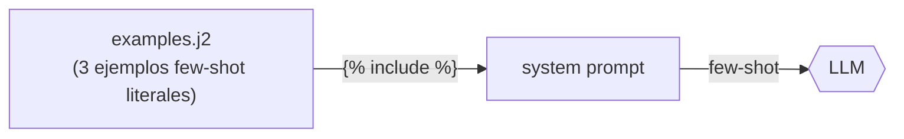

- Los ejemplos guían al modelo en **estructura, nivel de detalle y precios realistas** (few-shot
  learning).
- Esta capa es el **punto de sustitución futuro para RAG**: cuando llegue, los datos vendrán de una BD
  vectorial recuperados por similitud y se renderizarán a través del loader, igual que hoy los ejemplos
  literales del template.
- Solo contiene **datos**; ninguna lógica.

---

## 7. Infraestructura transversal

Piezas que no pertenecen a una capa de negocio concreta sino que **atraviesan** la aplicación. Se
inicializan en [`app/main.py`](app/main.py), que es el punto de entrada y compositor:

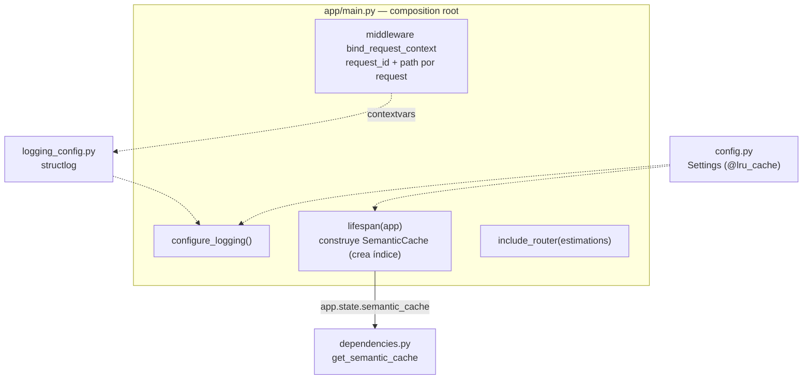

### 7.1 Configuración ([`app/config.py`](app/config.py))

`Settings(BaseSettings)` de pydantic-settings, **cacheado con `@lru_cache`** (una sola instancia por
proceso). Lee de `.env`. Variables:

| Variable | Default | Propósito |
|----------|---------|-----------|
| `OPENAI_API_KEY` | *(requerida)* | Credencial OpenAI |
| `ANTHROPIC_API_KEY` | *(requerida)* | Credencial Anthropic (fallback) |
| `LLM_MODEL` | `openai/gpt-4o-mini` | Modelo primario |
| `EMBEDDING_MODEL` | `openai/text-embedding-3-small` | Modelo de embedding (1536 dims) |
| `APP_ENV` | `development` | Dev → logs consola; `production` → JSON |
| `LOG_LEVEL` | `DEBUG` | Nivel de log |
| `REDIS_URL` | `redis://redis:6379` | Endpoint Redis Stack |
| `GUARDRAILS_ENFORCE` | `None` → APP_ENV | `True`=raise, `False`=log-only |
| `SEMANTIC_CACHE_ENFORCE` | `None` → APP_ENV | `True`=sirve hits, `False`=log-only |
| `SEMANTIC_CACHE_DISTANCE_THRESHOLD` | `0.15` | Distancia COSINE máxima para hit (≈0.85 sim) |

> **Seguridad:** las API keys viven en `.env` (ignorado por git y docker). **Nunca** se hornean en la
> imagen; se inyectan en runtime (`env_file` en Compose). No se reproducen en código, logs ni
> respuestas.

### 7.2 Inyección de dependencias ([`app/dependencies.py`](app/dependencies.py))

`get_semantic_cache(request)` extrae el `SemanticCache` de `app.state` y lo entrega a los endpoints vía
`Depends(get_semantic_cache)`. Patrón estándar de FastAPI: **una única instancia compartida** por toda
la app (el índice se crea una sola vez), inyectada donde haga falta, fácil de mockear en tests.

### 7.3 Ciclo de vida (lifespan)

El `@asynccontextmanager lifespan` en `main.py` gestiona recursos con vida igual a la de la app:

- **Startup**: construye el `SemanticCache` (`make_semantic_cache`) desde `REDIS_URL` y el
  `distance_threshold`. El constructor conecta a Redis Stack y **crea el índice vectorial**. Se guarda
  en `app.state.semantic_cache`.
- **Shutdown**: nada que cerrar explícitamente — redisvl gestiona su propio pool.

Esto garantiza un único índice/instancia por proceso, creado en el momento adecuado.

### 7.4 Logging estructurado (structlog)

[`app/logging_config.py`](app/logging_config.py) configura **structlog una sola vez** al arrancar:

- **`merge_contextvars`** — cada línea de log arrastra automáticamente las variables de contexto del
  request en curso.
- El **middleware `bind_request_context`** (en `main.py`) genera un `request_id` único (8 chars) y
  bindea `request_id` + `path` al inicio de cada request. Resultado: **toda** traza de una misma
  petición es correlacionable.
- **Access-log por request**: el mismo middleware cronometra la petición y emite `request_completed`
  con `method`, `status_code` y `duration_ms` (se omite `/health`). Un fallo no controlado se loguea
  como `request_failed` con traceback y se re-lanza. Clave para análisis de latencia y tasa de error.
- **Latencia del modelo aislada**: `llm_structured_call_completed` lleva `duration_ms` (además de
  tokens/retries), lo que permite separar el tiempo del LLM del resto (embedding, caché, render).
- **Tracebacks estructurados** en producción (`dict_tracebacks`): las excepciones viajan como árbol
  dentro del JSON. En desarrollo `ConsoleRenderer` ya pinta la excepción de forma legible.
- **Renderer según entorno**: `ConsoleRenderer` legible en desarrollo; `JSONRenderer` en producción
  (apto para agregadores de logs). Driven por `APP_ENV` y `LOG_LEVEL`.

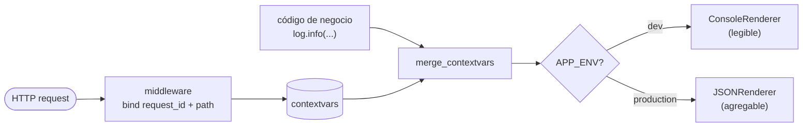

### 7.5 Caché Redis Stack (infraestructura)

Redis Stack es un **servicio de infraestructura** (no parte del backend). Su rol arquitectónico:

- **Caché semántico de respuestas LLM** con TTL de 24 h — reduce coste y latencia ante descripciones
  *semánticamente similares* (no solo idénticas). Necesita el motor de búsqueda vectorial de Redis
  Stack (`redis/redis-stack`), no el `redis:alpine` de S03.
- `SemanticCache` construido una vez en `lifespan`, inyectado vía `Depends(get_semantic_cache)`.
- **Degradación con gracia**: la lógica de `cache.py` trata cualquier fallo de Redis como no fatal, de
  modo que la disponibilidad del sistema no depende de la de Redis.
- En Compose, el backend **espera a que Redis esté `healthy`** (`depends_on` + `healthcheck`) antes de
  arrancar.

---

## 8. Despliegue y empaquetado

Orquestación con **Docker Compose** ([`docker-compose.yml`](docker-compose.yml)): tres servicios con
dependencias de arranque ordenadas por health checks.

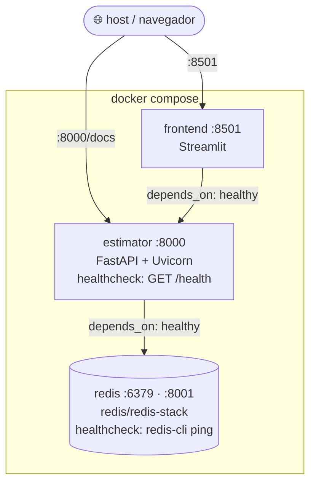

**Orden de arranque garantizado:** `redis (healthy) → estimator (healthy) → frontend`. Sin esto,
Streamlit podría levantarse antes que el backend y su primera petición fallaría.

### Imágenes Docker

Backend ([`Dockerfile`](Dockerfile)) y frontend ([`frontend/Dockerfile`](frontend/Dockerfile)) usan el
mismo patrón **multi-stage** con buenas prácticas:

- **Stage builder + stage runtime**: las herramientas de build (uv, compiladores) no llegan a la
  imagen final → menor tamaño y superficie de ataque.
- **uv** como gestor de paquetes (binario estático copiado desde la imagen oficial). `uv sync
  --frozen` respeta el lockfile.
- **Separación de dependencias enforced a nivel de imagen**: el frontend instala
  `--no-default-groups --group frontend`, así no arrastra `fastapi`/`openai`/`anthropic`. El backend
  instala `--no-dev` (sin pytest/ruff).
- **Usuario no-root** (`appuser`) en runtime — privilegios mínimos.
- **Health check nativo de Docker** vía `/health`.
- **`.env` nunca se hornea**: se inyecta en runtime.

### Entorno de desarrollo

- Gestor de paquetes **`uv`** (nunca `pip`). Python fijado a **3.11** vía `.python-version`.
- En Compose, *bind mounts* (`./app`, `./frontend`) + `--reload` para hot-reload sin rebuild.
- Local: `uv run uvicorn app.main:app --reload`. Swagger en `http://127.0.0.1:8000/docs`.

---

## 9. Decisiones de diseño y evolución futura

### Por qué esta arquitectura

| Decisión | Razón |
|----------|-------|
| **Capas estrictas con dependencias unidireccionales** | Cada pieza se prueba y sustituye en aislamiento; el dominio no se contamina con detalles de HTTP/LLM/caché. |
| **Servicio devuelve `dict`, no schemas** | Mantiene el núcleo de negocio agnóstico del borde HTTP; la validación vive solo en el router. |
| **`llm_wrapper` agnóstico de dominio** | Permite cambiar de proveedor o reutilizar el adaptador sin tocar el negocio. |
| **Caché degradable (no fuente de verdad)** | La disponibilidad del sistema no depende de Redis. |
| **Caché semántico (no exact-match)** | Los inputs humanos casi nunca son byte-idénticos; la similaridad acierta donde el sha256 fallaba. El bucket aísla por prompt_version + params. |
| **Vector propio (no vectorizer HF de redisvl)** | Evita meter torch/sentence-transformers; el embedding viaja por litellm, reutilizable para el RAG. |
| **Caché en modo log-only primero** | Observar hit-rate y calibrar el threshold con datos reales antes de servir hits. |
| **Fallback de proveedores vía litellm `fallbacks=`** | Resiliencia: si OpenAI cae, responde Anthropic, de forma transparente. |
| **Prompt en templates Jinja2 versionados, no en f-strings** | Versionar e iterar el prompt sin tocar el código de negocio; loader desacoplado del borde HTTP. |
| **Parámetros tipados (Enums) en vez de texto libre** | Entrada de producto validada en el borde; cada combinación produce un prompt distinto (y por tanto clave de caché distinta). |
| **structlog + request_id** | Trazabilidad de extremo a extremo de cada petición. |

### Hoja de ruta (CAG → RAG → agentes)

El proyecto está en fase **CAG**: los ejemplos few-shot están precargados estáticamente, literales en
`prompts/estimation/v1/examples.j2`. El diseño anticipa la evolución:

- **→ RAG**: los ejemplos literales del template se sustituyen por recuperación desde una BD vectorial
  por similitud, renderizados a través del mismo loader. `context/` se reactiva como fuente de datos.
  El módulo `embeddings.py` (hoy semilla, usado solo por el cache) será la base de la recuperación.
- **→ Agentes**: módulos posteriores del máster.

### Pendientes conocidos

- **Validación-en-stream**: la mecánica exacta (validar Partials a mitad de stream vs post-hoc al
  cerrar) es PROVISIONAL, pendiente de la sesión en vivo. Implementado el mínimo: acumular + validar al final.
- **Tracker de hit-rate del cache semántico**: en modo log-only se loguea (input, vecino top-1,
  distancia); falta un agregador para **calibrar el `distance_threshold`** con datos reales.
- **Tracker/métricas de guardrails**: los disparos se loguean; falta un dashboard/agregador.

### Restricciones vigentes

- Embeddings permitidos SOLO para el cache semántico (`embeddings.py`). NO introducir RAG/retrieval, BD
  vectorial como feature, ni persistencia de dominio todavía (fase CAG).
- No usar el vectorizer HF local de redisvl (mete torch). Vector vía `litellm.aembedding`, pasado con `vector=`.
- No usar `instructor.patch(Router(...))` — bug conocido de carryover de params.
- No reproducir credenciales ni valores del `.env` en código, logs ni respuestas.
- Toda dependencia se gestiona vía `uv add` (reflejada en `pyproject.toml` + `uv.lock`).
```
