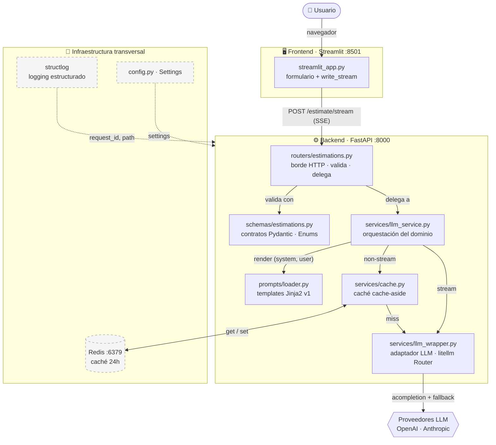
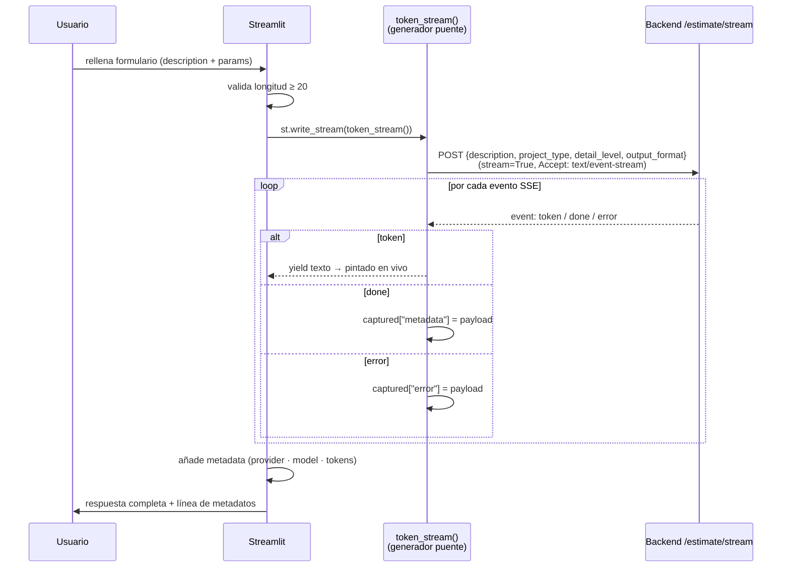
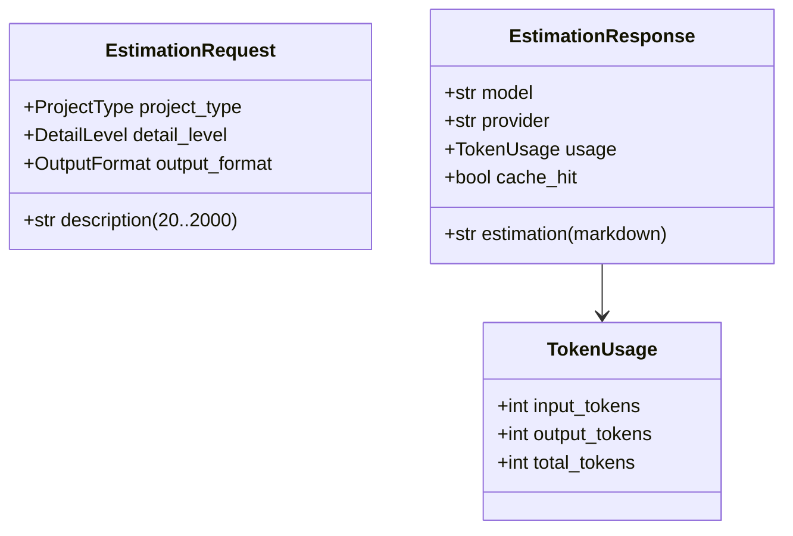
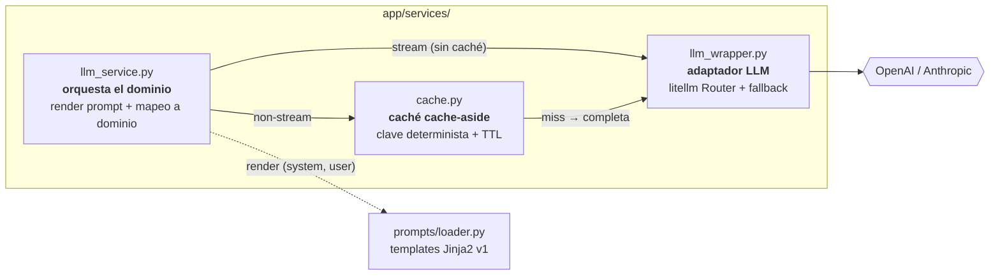
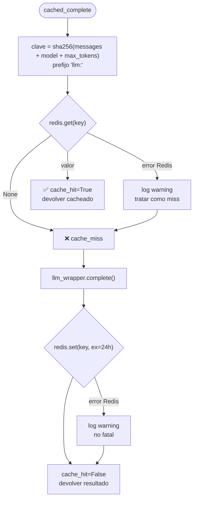
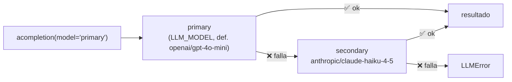
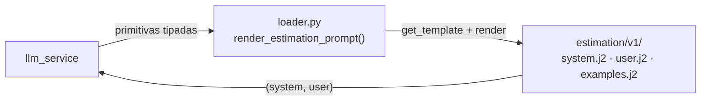
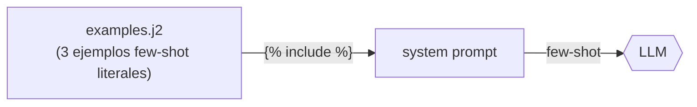
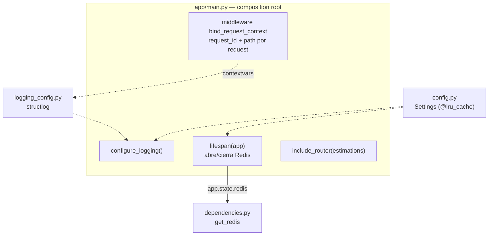
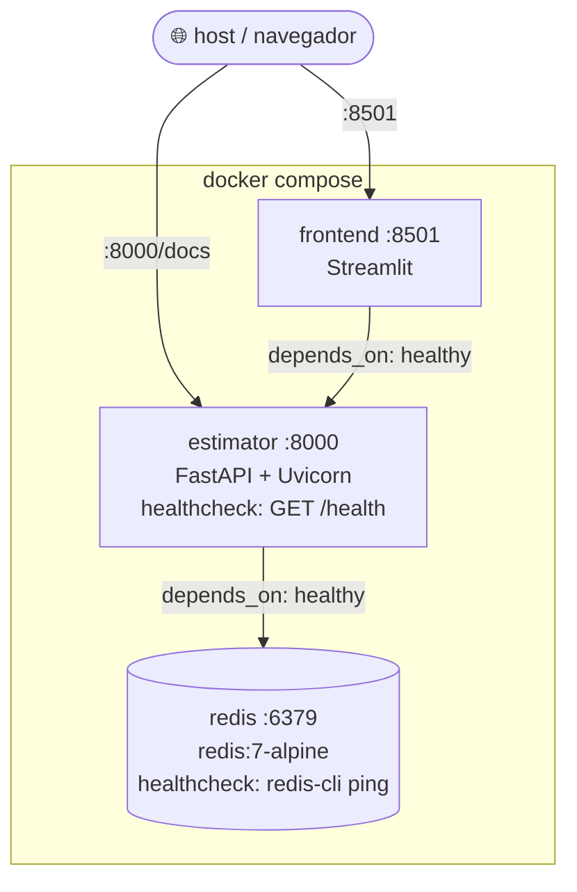

# Arquitectura del Estimador CAG

> Sistema de estimación de software construido con **arquitectura CAG** (Context-Augmented Generation).
> API REST en **FastAPI** + frontend conversacional en **Streamlit**, con **Redis** como caché de
> respuestas LLM y **structlog** para observabilidad. Parte del máster LIDR (RAG & Agentes); el diseño
> está preparado para evolucionar de CAG → RAG → agentes sin reescribir las capas externas.

Este documento describe la arquitectura end-to-end. La **sección 1** da la visión general (el mapa).
Las **secciones siguientes** profundizan capa por capa, respetando la misma separación de
responsabilidades que el código. Está pensado para que alguien que no conoce el proyecto entienda
tanto *qué hace* como *por qué está construido así*.

---

## Tabla de contenidos

1. [Visión general de la arquitectura](#1-visión-general-de-la-arquitectura)
2. [Frontend — Streamlit (capa de presentación)](#2-frontend--streamlit-capa-de-presentación)
3. [Routers — borde HTTP](#3-routers--borde-http)
4. [Schemas — contratos Pydantic](#4-schemas--contratos-pydantic)
5. [Services — lógica de negocio](#5-services--lógica-de-negocio)
   - [5.1 `llm_service` — orquestación](#51-llm_service--orquestación-del-dominio)
   - [5.2 `cache` — caché Redis](#52-cache--caché-cache-aside-sobre-redis)
   - [5.3 `llm_wrapper` — adaptador LLM](#53-llm_wrapper--adaptador-llm-agnóstico-de-dominio)
   - [5.4 `prompts` — templates Jinja2](#54-prompts--templates-jinja2-versionados)
6. [Context — datos CAG](#6-context--datos-de-referencia-cag)
7. [Infraestructura transversal](#7-infraestructura-transversal)
   - [7.1 Configuración](#71-configuración-appconfigpy)
   - [7.2 Inyección de dependencias](#72-inyección-de-dependencias-appdependenciespy)
   - [7.3 Ciclo de vida (lifespan)](#73-ciclo-de-vida-lifespan)
   - [7.4 Logging estructurado](#74-logging-estructurado-structlog)
   - [7.5 Caché Redis](#75-caché-redis-infraestructura)
8. [Despliegue y empaquetado](#8-despliegue-y-empaquetado)
9. [Decisiones de diseño y evolución futura](#9-decisiones-de-diseño-y-evolución-futura)

---

## 1. Visión general de la arquitectura

El sistema se compone de **dos servicios desplegables** (frontend y backend) y **un servicio de
infraestructura** (Redis), orquestados con Docker Compose. El backend aplica una **arquitectura por
capas estricta**: cada capa solo conoce la inmediatamente inferior, y las responsabilidades no se
mezclan.



### Las capas de un vistazo

| Capa | Archivo(s) | Responsabilidad | Lo que **NO** hace |
|------|-----------|-----------------|--------------------|
| **Frontend** | `frontend/streamlit_app.py` | Formulario de producto (descripción + parámetros tipados), consume el stream SSE, pinta tokens en vivo | No habla con el LLM ni conoce su API |
| **Routers** | `app/routers/estimations.py` | Recibe HTTP, valida, **delega**, traduce errores a códigos HTTP | Sin lógica de negocio |
| **Schemas** | `app/schemas/estimations.py` | Contrato Pydantic request/response (Enums tipados) — el borde HTTP | No es el núcleo del dominio |
| **Services** | `app/services/*.py` | Lógica de negocio: orquestación, caché, llamada LLM, post-proceso | No conoce HTTP |
| **Prompts** | `app/prompts/` | Templates Jinja2 versionados + loader; renderiza `(system, user)` | No conoce HTTP ni el LLM |
| **Context** | `app/context/examples.py` | Datos de referencia (obsoleto en CAG; vuelve en RAG) | No formatea el prompt |
| **Infra** | `config`, `dependencies`, `logging_config`, `main` | Configuración, DI, logging, ciclo de vida | No es lógica de dominio |

### Principio rector: dirección de las dependencias

El flujo de control siempre va **de fuera hacia dentro**, y las dependencias nunca se invierten:

```
Frontend → Router → Service → Cache → Wrapper → Proveedor LLM
                       │
                       └─→ Prompts (loader + templates Jinja2)
```

- El **núcleo de negocio (services) es agnóstico del borde HTTP**: devuelve `dict` planos, no
  instancia los schemas Pydantic. La validación contra los schemas ocurre solo en el router.
- El **`llm_wrapper` es agnóstico del dominio**: no sabe nada de "estimaciones", solo habla LLM.
  Esto permite reutilizarlo y sustituir el proveedor sin tocar el negocio.

---

## 2. Frontend — Streamlit (capa de presentación)

Aplicación Streamlit independiente ([`frontend/streamlit_app.py`](frontend/streamlit_app.py)) que
ofrece una **interfaz de formulario de producto** (descripción + parámetros tipados), no un chat libre.
Es un **servicio separado** del backend: su propio contenedor, su propio grupo de dependencias
(`requests`, `sseclient-py`, `streamlit`) y **cero acoplamiento** con el código de `app/`.

### Responsabilidades

- Presentar un `st.form` con el campo `description` y tres selectores (`project_type`, `detail_level`,
  `output_format`). Los labels son legibles, pero el valor enviado es **exactamente** el value del Enum
  del backend (case-sensitive — el backend corre en Linux).
- Validar longitud mínima de la descripción (20 caracteres) **antes** de llamar al backend.
- Consumir el endpoint de **streaming** vía SSE y pintar los tokens en vivo con `st.write_stream`.

### Patrón clave: puente SSE → `write_stream`

`st.write_stream` solo sabe pintar fragmentos de texto, pero el backend emite **tres tipos de evento
SSE** (`token`, `done`, `error`). El frontend resuelve esto con un *generador puente* y un
*side-channel* capturado por clausura:



Los eventos `done` (metadatos) y `error` no se pintan como texto: se guardan en el dict `captured` y
se procesan **después** de que el generador se agote, cuando `write_stream` ya ha devuelto el texto
completo concatenado.

### Manejo de errores

- **Backend caído / no-2xx antes del stream** (p. ej. `422` de validación) → `RequestException`,
  mensaje "¿Está levantado?".
- **Fallo del backend a mitad de generación** → llega como evento SSE `error`, se muestra como aviso.

La URL del backend se configura con `BACKEND_URL` ([`frontend/config.py`](frontend/config.py)), con
default `http://estimator:8000` (el nombre del servicio en Compose). Para correr Streamlit en local
contra el backend local: `BACKEND_URL=http://localhost:8000`.

---

## 3. Routers — borde HTTP

[`app/routers/estimations.py`](app/routers/estimations.py) define el `APIRouter` con prefijo
`/api/v1`. Es el **borde HTTP**: recibe, valida (vía schema y `Depends`), **delega** al servicio y
traduce el resultado/errores a HTTP. **No contiene lógica de negocio.**

### Endpoints

| Método | Ruta | Respuesta | Caché | Uso |
|--------|------|-----------|-------|-----|
| `POST` | `/api/v1/estimate` | `EstimationResponse` (JSON) | ✅ Redis | Consumidores programáticos |
| `POST` | `/api/v1/estimate/stream` | SSE (`EventSourceResponse`) | ❌ (pendiente) | UIs conversacionales |
| `GET`  | `/health` | `{"status": "healthy"}` | — | Health check (Docker/orquestador) |

### Patrón de delegación

```python
@router.post("/estimate", response_model=EstimationResponse)
async def create_estimation(request: EstimationRequest, redis = Depends(get_redis)):
    try:
        result = await generate_estimation(                              # desempaqueta el schema
            request.description, request.project_type.value,
            request.detail_level.value, request.output_format.value, redis,
        )
    except LLMError as exc:
        raise HTTPException(status_code=500, detail=str(exc))             # traduce error
    return EstimationResponse(**result)                                   # valida en el borde
```

Cuatro detalles arquitectónicos importantes:

1. **El router es el único que toca el schema** — desempaqueta `EstimationRequest` en primitivas
   (`.value` de cada Enum) antes de delegar. El servicio y la capa de prompts reciben primitivas, no
   el contrato HTTP.
2. **Inyección de Redis vía `Depends(get_redis)`** — el router no construye el cliente, lo recibe.
3. **`LLMError → HTTPException(500)`** — la excepción de dominio del wrapper se traduce a HTTP
   *solo aquí*. El servicio nunca conoce códigos HTTP.
4. **`EstimationResponse(**result)`** — la validación Pydantic ocurre en el borde, sobre el `dict`
   plano que devuelve el servicio.

El endpoint de stream traduce los eventos tipados del servicio (`token` / `done`) a `ServerSentEvent`,
y captura `LLMError` para emitir un evento SSE `error` en lugar de romper la conexión.

---

## 4. Schemas — contratos Pydantic

[`app/schemas/estimations.py`](app/schemas/estimations.py) (nombre en **plural**; el import correcto
es `from app.schemas.estimations import ...`). Define el **contrato HTTP**, no el núcleo del dominio.



- **`EstimationRequest`** — valida la entrada en el borde: `description` (20–2000 caracteres) más tres
  parámetros tipados como Enums (`ProjectType`, `DetailLevel`, `OutputFormat`). Una petición fuera de
  rango o con un valor de Enum inválido produce automáticamente un `422` antes de tocar la lógica de
  negocio. Estos parámetros, ya validados, son los que alimentan el render del prompt.
- **`EstimationResponse`** — forma de la salida no-stream, incluido `cache_hit` (transparencia sobre
  si la respuesta vino de caché) y el desglose de `usage`.

Los schemas son deliberadamente delgados: son el **contrato del borde**, no estructuras que circulen
por el dominio. Por eso el servicio devuelve `dict` y es el router quien instancia el schema.

---

## 5. Services — lógica de negocio

El corazón del sistema. Tres módulos con responsabilidades nítidas y dependencias en una sola
dirección:



Niveles de abstracción (de mayor a menor):

- **`llm_service`** conoce el *dominio* (estimaciones); delega el contenido del prompt al loader.
- **`prompts/loader`** conoce el *formato del prompt* (templates Jinja2 versionados), pero ni HTTP ni el LLM.
- **`cache`** conoce el *patrón de caché* (clave, TTL, degradación), pero no el dominio.
- **`llm_wrapper`** conoce el *proveedor LLM* (litellm, fallback), pero ni el dominio ni la caché.

### 5.1 `llm_service` — orquestación del dominio

[`app/services/llm_service.py`](app/services/llm_service.py). Es la **única capa que conoce el
dominio "estimación"**. Responsabilidades:

1. **Pedir el prompt al loader** (`render_estimation_prompt`): el contenido del prompt (rol, reglas,
   formato de salida, tarifas, ejemplos) ya **no se construye con f-strings aquí** — vive en los
   templates Jinja2 versionados de `app/prompts/`. El servicio solo pasa las primitivas tipadas
   (`description`, `project_type`, `detail_level`, `output_format`) y recibe la tupla `(system, user)`.
2. **Ensamblar los mensajes** (`_build_messages`): `messages = [system, user]`.
3. **Mapear el resultado a un `dict` plano del dominio** `{estimation, model, provider, usage,
   cache_hit}` — sin instanciar schemas Pydantic (mantiene el núcleo agnóstico del borde HTTP).

Dos puntos de entrada según el modo:

| Función | Modo | Camino | Caché |
|---------|------|--------|-------|
| `generate_estimation` | one-shot | → `cache.cached_complete` | ✅ |
| `generate_estimation_stream` | streaming (async generator) | → `llm_wrapper.stream` directo | ❌ |

`MAX_TOKENS = 4000` es una decisión de dominio: las estimaciones caben holgadamente por debajo de
ese límite.

### 5.2 `cache` — caché cache-aside sobre Redis

[`app/services/cache.py`](app/services/cache.py). Capa de **caché exacta (exact-match)** sobre la
completación no-streaming del wrapper. Implementa el patrón **cache-aside**:



**Decisiones de diseño:**

- **Clave determinista**: `json.dumps(..., sort_keys=True)` garantiza serialización estable
  independientemente del orden de claves; `sha256` da una clave estable entre procesos (el `hash()`
  de Python está aleatorizado por arranque). La clave incluye **todo lo que afecta a la respuesta**
  (mensajes, modelo, max_tokens), de modo que un cambio de prompt invalida la entrada automáticamente.
- **La caché es una optimización, no la fuente de verdad**: cualquier fallo de Redis (lectura o
  escritura) se **degrada con gracia** — se loguea como `warning` y se trata como miss o se ignora,
  nunca se propaga como error. El sistema sigue funcionando con Redis caído, solo más lento.
- **TTL de 24 h** (`CACHE_TTL_SECONDS = 86400`).
- **`cache_hit`** se añade al resultado para que el borde lo exponga (transparencia al cliente).

### 5.3 `llm_wrapper` — adaptador LLM agnóstico de dominio

[`app/services/llm_wrapper.py`](app/services/llm_wrapper.py). Adaptador que habla con los proveedores
LLM vía **litellm**. **No sabe nada del dominio**: recibe `messages`, devuelve texto + metadatos.

**Fallback automático de proveedores con litellm `Router`:**



- **Router como singleton**, construido una vez en tiempo de import. Esto (a) preserva el estado de
  *cooldown* entre peticiones y (b) **falla rápido al arrancar** si la config es inválida, en lugar de
  en la primera petición de producción.
- **`fallbacks=[{"primary": ["secondary"]}]`** — si el modelo primario falla, litellm reintenta
  automáticamente con el secundario (Anthropic Claude Haiku). El parámetro `model` que reciben
  `complete`/`stream` se acepta por compatibilidad de interfaz, pero **es el Router quien decide** el
  proveedor real.

**Dos modos, dos formas de salida:**

- **`complete`** (one-shot) → `dict` `{content, model, provider, usage}`. Captura cualquier excepción
  del proveedor y la envuelve en `LLMError` (la excepción de dominio que el router traduce a HTTP 500).
- **`stream`** (async generator) → emite **eventos tipados**:
  - `{"type": "token", "data": str}` — fragmento de texto.
  - `{"type": "done", "metadata": {...}}` — evento final con modelo, proveedor y `usage` (se pide con
    `stream_options={"include_usage": True}`).

`_resolve_provider` deduce el proveedor real (`get_llm_provider`) a partir del modelo que efectivamente
respondió — relevante porque, con fallback, puede no ser el primario.

### 5.4 `prompts` — templates Jinja2 versionados

[`app/prompts/`](app/prompts/). El **contenido del prompt está separado de la orquestación**: vive en
templates Jinja2 versionados en lugar de en f-strings dentro del servicio. Esto permite versionar e
iterar el prompt sin tocar el código de negocio.



- **`loader.render_estimation_prompt(description, project_type, detail_level, output_format, version="v1")`**
  → devuelve la tupla `(system, user)`. Recibe **primitivas tipadas, no `EstimationRequest`**: la capa
  de prompts queda desacoplada del borde HTTP, igual que el servicio devuelve `dict`.
- **`Environment`** con `FileSystemLoader(PROMPTS_DIR)`, `trim_blocks` / `lstrip_blocks` y
  **`StrictUndefined`**: si un template referencia una variable que no está en el contexto, falla en el
  render en lugar de producir un prompt con huecos silenciosos.
- **Delimitadores Markdown** (`## Section`), no XML: el sistema es **LLM-agnóstico** vía LiteLLM (sin
  "proveedor principal"), y Markdown es el formato neutro mejor entendido por todos los proveedores.
- **`system.j2`** define rol, reglas y tarifas; ramifica según `output_format` (los tres valores:
  `phases_table`, `line_items`, `narrative`) y añade un bloque extra (assumptions + intervalo de
  confianza) solo cuando `detail_level == "detailed"`. Termina con ``.
- **`examples.j2`** contiene los ejemplos few-shot **literales en Markdown** (migrados desde
  `context/examples.py`). En la fase CAG esta es la fuente de los ejemplos; en RAG vendrán de la BD
  vectorial.
- **Versionado por carpeta** (`v1/`): convivir varias versiones del prompt es cuestión de añadir `v2/`
  y pasar `version="v2"`.

---

## 6. Context — datos de referencia CAG

[`app/context/examples.py`](app/context/examples.py). Contiene `ESTIMATION_EXAMPLES`: una lista de
estimaciones de referencia (resumen de reunión + estimación completa en markdown).

> **Estado (deuda técnica).** En la fase CAG actual este módulo está **obsoleto**: los ejemplos
> few-shot se han migrado, literales en Markdown, a `app/prompts/estimation/v1/examples.j2`. No se borra
> a propósito — se reintroducirá como **fuente de datos** en el módulo RAG, cuando los ejemplos vengan de
> una BD vectorial recuperados por similitud (entonces el loader renderizará lo recuperado en lugar de
> texto fijo). La sección se conserva porque explica el "Context-Augmented" de CAG: el contexto
> **precargado estáticamente** que acompaña a cada petición.



- Los ejemplos guían al modelo en **estructura, nivel de detalle y precios realistas** (few-shot
  learning).
- Esta capa es el **punto de sustitución futuro para RAG**: cuando llegue, los datos vendrán de una BD
  vectorial recuperados por similitud y se renderizarán a través del loader, igual que hoy los ejemplos
  literales del template.
- Solo contiene **datos**; ninguna lógica.

---

## 7. Infraestructura transversal

Piezas que no pertenecen a una capa de negocio concreta sino que **atraviesan** la aplicación. Se
inicializan en [`app/main.py`](app/main.py), que es el punto de entrada y compositor:



### 7.1 Configuración ([`app/config.py`](app/config.py))

`Settings(BaseSettings)` de pydantic-settings, **cacheado con `@lru_cache`** (una sola instancia por
proceso). Lee de `.env`. Variables:

| Variable | Default | Propósito |
|----------|---------|-----------|
| `OPENAI_API_KEY` | *(requerida)* | Credencial OpenAI |
| `ANTHROPIC_API_KEY` | *(requerida)* | Credencial Anthropic (fallback) |
| `LLM_MODEL` | `openai/gpt-4o-mini` | Modelo primario |
| `APP_ENV` | `development` | Dev → logs consola; `production` → JSON |
| `LOG_LEVEL` | `DEBUG` | Nivel de log |
| `REDIS_URL` | `redis://redis:6379` | Endpoint Redis |

> **Seguridad:** las API keys viven en `.env` (ignorado por git y docker). **Nunca** se hornean en la
> imagen; se inyectan en runtime (`env_file` en Compose). No se reproducen en código, logs ni
> respuestas.

### 7.2 Inyección de dependencias ([`app/dependencies.py`](app/dependencies.py))

`get_redis(request)` extrae el cliente Redis de `app.state` y lo entrega a los endpoints vía
`Depends(get_redis)`. Patrón estándar de FastAPI: **un único cliente compartido** por toda la app,
inyectado donde haga falta, fácil de mockear en tests.

### 7.3 Ciclo de vida (lifespan)

El `@asynccontextmanager lifespan` en `main.py` gestiona recursos con vida igual a la de la app:

- **Startup**: abre el cliente `redis.asyncio` desde `REDIS_URL` (conexión lazy — real en el
  primer comando) y lo guarda en `app.state.redis`.
- **Shutdown**: cierra limpiamente el pool de conexiones (`aclose()`).

Esto garantiza un único pool de conexiones por proceso, creado/cerrado en el momento adecuado.

### 7.4 Logging estructurado (structlog)

[`app/logging_config.py`](app/logging_config.py) configura **structlog una sola vez** al arrancar:

- **`merge_contextvars`** — cada línea de log arrastra automáticamente las variables de contexto del
  request en curso.
- El **middleware `bind_request_context`** (en `main.py`) genera un `request_id` único (8 chars) y
  bindea `request_id` + `path` al inicio de cada request. Resultado: **toda** traza de una misma
  petición es correlacionable.
- **Renderer según entorno**: `ConsoleRenderer` legible en desarrollo; `JSONRenderer` en producción
  (apto para agregadores de logs). Driven por `APP_ENV` y `LOG_LEVEL`.


### 7.5 Caché Redis (infraestructura)

Redis es un **servicio de infraestructura** (no parte del backend). Su rol arquitectónico:

- **Caché de respuestas LLM** con TTL de 24 h — reduce coste y latencia ante transcripciones
  repetidas.
- Cliente gestionado por `lifespan`, inyectado vía `Depends(get_redis)`.
- **Degradación con gracia**: la lógica de `cache.py` trata cualquier fallo de Redis como no fatal, de
  modo que la disponibilidad del sistema no depende de la de Redis.
- En Compose, el backend **espera a que Redis esté `healthy`** (`depends_on` + `healthcheck`) antes de
  arrancar.

---

## 8. Despliegue y empaquetado

Orquestación con **Docker Compose** ([`docker-compose.yml`](docker-compose.yml)): tres servicios con
dependencias de arranque ordenadas por health checks.



**Orden de arranque garantizado:** `redis (healthy) → estimator (healthy) → frontend`. Sin esto,
Streamlit podría levantarse antes que el backend y su primera petición fallaría.

### Imágenes Docker

Backend ([`Dockerfile`](Dockerfile)) y frontend ([`frontend/Dockerfile`](frontend/Dockerfile)) usan el
mismo patrón **multi-stage** con buenas prácticas:

- **Stage builder + stage runtime**: las herramientas de build (uv, compiladores) no llegan a la
  imagen final → menor tamaño y superficie de ataque.
- **uv** como gestor de paquetes (binario estático copiado desde la imagen oficial). `uv sync
  --frozen` respeta el lockfile.
- **Separación de dependencias enforced a nivel de imagen**: el frontend instala
  `--no-default-groups --group frontend`, así no arrastra `fastapi`/`openai`/`anthropic`. El backend
  instala `--no-dev` (sin pytest/ruff).
- **Usuario no-root** (`appuser`) en runtime — privilegios mínimos.
- **Health check nativo de Docker** vía `/health`.
- **`.env` nunca se hornea**: se inyecta en runtime.

### Entorno de desarrollo

- Gestor de paquetes **`uv`** (nunca `pip`). Python fijado a **3.11** vía `.python-version`.
- En Compose, *bind mounts* (`./app`, `./frontend`) + `--reload` para hot-reload sin rebuild.
- Local: `uv run uvicorn app.main:app --reload`. Swagger en `http://127.0.0.1:8000/docs`.

---

## 9. Decisiones de diseño y evolución futura

### Por qué esta arquitectura

| Decisión | Razón |
|----------|-------|
| **Capas estrictas con dependencias unidireccionales** | Cada pieza se prueba y sustituye en aislamiento; el dominio no se contamina con detalles de HTTP/LLM/caché. |
| **Servicio devuelve `dict`, no schemas** | Mantiene el núcleo de negocio agnóstico del borde HTTP; la validación vive solo en el router. |
| **`llm_wrapper` agnóstico de dominio** | Permite cambiar de proveedor o reutilizar el adaptador sin tocar el negocio. |
| **Caché degradable (no fuente de verdad)** | La disponibilidad del sistema no depende de Redis. |
| **Fallback de proveedores vía litellm Router** | Resiliencia: si OpenAI cae, responde Anthropic, de forma transparente. |
| **Prompt en templates Jinja2 versionados, no en f-strings** | Versionar e iterar el prompt sin tocar el código de negocio; loader desacoplado del borde HTTP. |
| **Parámetros tipados (Enums) en vez de texto libre** | Entrada de producto validada en el borde; cada combinación produce un prompt distinto (y por tanto clave de caché distinta). |
| **structlog + request_id** | Trazabilidad de extremo a extremo de cada petición. |

### Hoja de ruta (CAG → RAG → agentes)

El proyecto está en fase **CAG**: los ejemplos few-shot están precargados estáticamente, literales en
`prompts/estimation/v1/examples.j2`. El diseño anticipa la evolución:

- **→ RAG**: los ejemplos literales del template se sustituyen por recuperación desde una BD vectorial
  por similitud, renderizados a través del mismo loader. `context/` se reactiva como fuente de datos.
- **→ Agentes**: módulos posteriores del máster.

### Pendientes conocidos

- **Caché del endpoint de streaming** (`/estimate/stream`): hoy no usa Redis. Se abordará junto con la
  extracción de datos estructurados desde el LLM, que hará las respuestas deterministas y simplificará
  el cacheo del stream.

### Restricciones vigentes

- No introducir RAG, embeddings, BD vectorial ni persistencia todavía (fase CAG).
- No reproducir credenciales ni valores del `.env` en código, logs ni respuestas.
- Toda dependencia se gestiona vía `uv add` (reflejada en `pyproject.toml` + `uv.lock`).
```
